.. _rtd-gh-chapter:

GitHub и Read The Docs
======================

В главе  описывается взаимодействие двух сервисов и приводятся рекомендации по их настройке.

.. _github-work:

Работа с GitHub
---------------

GitHub обладает богатым набором функций. В данном разделе будут описаны только основные функции, необходимые для совместной работы над документацией. За дополнительной информацией обратитесь к следующим материалам:

* `Официальное руководство Pro Git <http://git-scm.com/book/ru/v1>`_
* `Интерактивный русскоязычный тур Git How To <http://githowto.com/ru>`_
* `UnixLab: GitHub и pastebin: что и зачем? <http://www.unix-lab.org/posts/github/>`_
* `Github — без командной строки <http://habrahabr.ru/post/233719/>`_

Что такое GitHub
~~~~~~~~~~~~~~~~

GitHub (https://github.com) — веб-сервис для хостинга IT-проектов и их совместной разработки, основанный на системе контроля версий Git. Сервис абсолютно бесплатен для проектов с открытым исходным кодом. Для создания закрытых проектов предлагаются различные платные тарифные планы.

GitHub позволяет:

* Размещать исходный код программ;
* Комментировать и обсуждать правки;
* Следить за обновлениями проектов;
* Копировать и скачивать репозитории проектов;
* Объединять репозитории;
* Создавать небольшие Вики проектов;
* Редактировать файлы непосредственно через веб-интерфейс;
* Создавать статичные HTML-страницы проектов;
* Для платных аккаунтов доступно создание приватных репозиториев, доступных ограниченному кругу пользователей.

Кроме Git, сервис поддерживает получение и редактирование кода через SVN и Mercurial.

Также на сайте есть pastebin-сервис `gist.github.com <https://gist.github.com>`_ для быстрой публикации фрагментов кода.

Для комфортной работы с GitHub, необходимо уметь работать с системой контроля версий Git, подробнее смотрите главу :ref:`git-chapter`.

Регистрация
~~~~~~~~~~~

Процедура регистрации проста, бесплатна и не занимает много времени. Достаточно заполнить три поля: логин, адрес электронной почты и пароль. На почту будет выслан запрос на подтверждение регистрации.

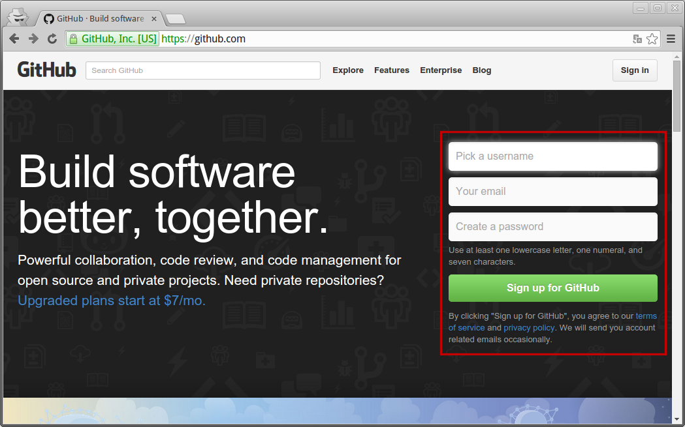

Создание репозитория
~~~~~~~~~~~~~~~~~~~~

GitHub — это не простой хостинг файлов, он завязан на систему  управления версиями файлов и служит для выгрузки локальных пользовательских git-репозиториев.

Для создания репозитория нажмите значок ``+`` и выберите пункт ``New repository``.

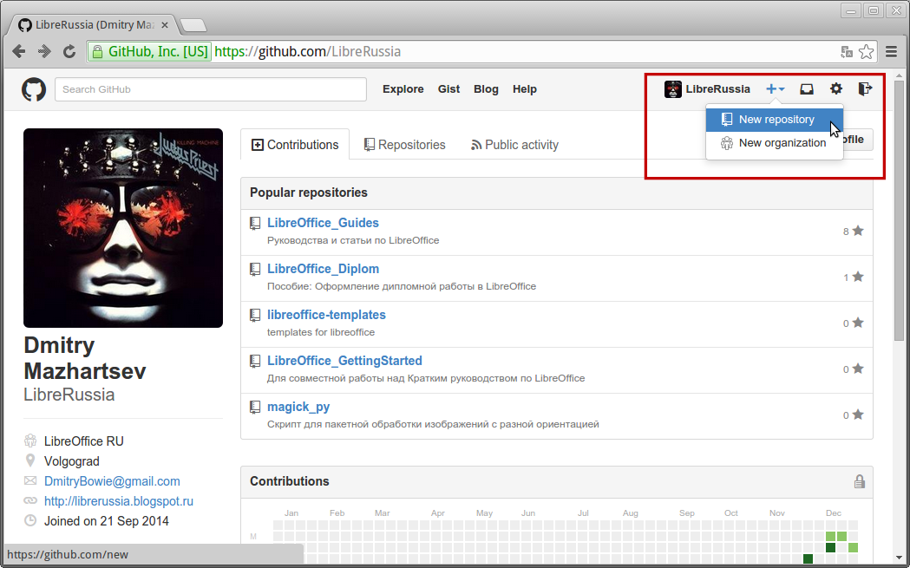
    

Будет открыта страница, на которой задается название репозитория и его описание.

.. figure:: _static/git-img-002.png
    :scale: 40 %
    :align: center
    :alt: GitHub: Создание нового репозитория. Шаг 2.
    
    
Чтобы создать новый репозиторий на компьютере и выгрузить его в репозиторий на GitHub, выполните в командной строке:
::

    touch README.md
    git init
    git add README.md
    git commit -m "first commit"
    git remote add origin https://github.com/LibreRussia/my-project.git
    git push -u origin master

.. note:: Используйте URL-адрес вашего репозитория для команды ``remote``.

.. index:: git remote

Чтобы выгрузить в репозиторий на GitHub уже существующий репозиторий выполните  в командной строке:
::

    git remote add origin https://github.com/LibreRussia/my-project.git
    git push -u origin master

.. figure:: _static/git-img-003.png
    :scale: 40 %
    :align: center
    :alt: GitHub: Создание нового репозитория. Шаг 3.

Выгружать файлы в репозиторий на GitHub могут только те пользователи, которые имеют право на запись. Загрузить же копию репозитория на компьютер может любой пользователей, если это не ограничено настройками приватности репозитория (доступно в платных тарифах).

Также имеется возможность создавать совместные для нескольких аккаунтов репозитории. В целях безопасности я предпочитаю не давать никому доступ к основному репозиторию и работаю через систему форков (см. :ref:`git-fork-label`).

.. _git-fork-label:

Копирование репозитория (Fork)
~~~~~~~~~~~~~~~~~~~~~~~~~~~~~~

Любой желающий может сделать полную копию(англ. *Fork* — разветвление) чужого репозитория и работать над ней независимо от основного. После внесения всех изменений, можно предложить их в основной репозиторий (сделать, так называемый, :ref:`pull-requests`).

Чтобы создать форк, необходимо зайти в репозиторий и нажать кнопку ``Fork``.

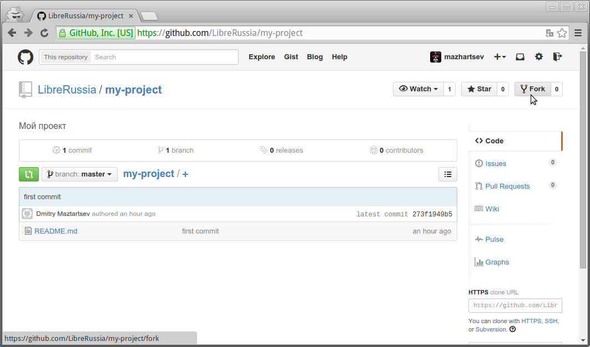
    

После чего в аккаунте пользователя появится полная копия репозитория.

.. figure:: _static/git-img-005.png
    :scale: 40 %
    :align: center
    :alt: GitHub: Создание копии репозитория.

В качестве примера я сделал форк репозитория ``My_Project`` пользователя LibreRussia. Теперь в моем аккаунте (mazhartsev) есть его полная копия, с которой я могу спокойно работать не опасаясь покорёжить основной.

Теперь внесем изменения в файл ``README.md``, выбрав его и нажав значок с карандашом. 

.. figure:: _static/git-img-006a.png
    :scale: 40 %
    :align: center
    :alt: GitHub: Онлайн редактирование текстовых файлов.

Одна из дополнительных приятных функций GitHub — возможность редактировать текстовые файлы через браузер. 

Добавим строку ``Привет, Мир!`` и сохраним файл.

.. figure:: _static/git-img-007.png
    :scale: 40 %
    :align: center
    :alt: GitHub: Онлайн редактирование текстовых файлов.

Теперь предложим наши изменения в основной репозиторий, то есть сделаем :ref:`pull-requests`. 

.. _pull-requests:

Pull Requests
~~~~~~~~~~~~~

Для того, чтобы предложить свои изменения в основной репозиторий, необходимо перейти в раздел Pull Requests и нажать кнопку ``New pull request``.

.. figure:: _static/git-img-007a.png
    :scale: 40 %
    :align: center
    :alt: GitHub: Создание Pull Requests.
    

.. figure:: _static/git-img-008.png
    :scale: 40 %
    :align: center
    :alt: GitHub: Создание Pull Requests.

Будет открыта страница, показывающая внесенные изменения. Нажимаем ``Create pull request``.

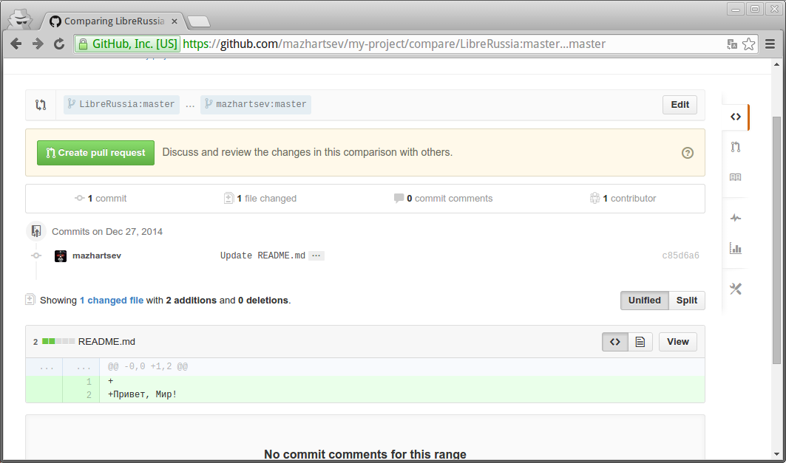
   

Далее будет предложено оставить комментарий к предлагаемым изменениям. Подробно описывать все внесенные изменения не надо, Git сам покажет их.

.. figure:: _static/git-img-010.png
    :scale: 40 %
    :align: center
    :alt: GitHub: Создание Pull Requests.

.. figure:: _static/git-img-011.png
    :scale: 40 %
    :align: center
    :alt: GitHub: Создание Pull Requests.

Внесенные изменения отправлены на рассмотрение владельцу основного репозитория, который получит соответствующие уведомления на электронный адрес и в интерфейсе GitHub. Для демонстрации я перейду из своего аккаунта в аккаунт LibreRussia.

Принятие Pull Requests
^^^^^^^^^^^^^^^^^^^^^^

Уведомление о предложенных изменениях приходят на электронную почту владельца репозитория и отображаются в интерфейсе GitHub.

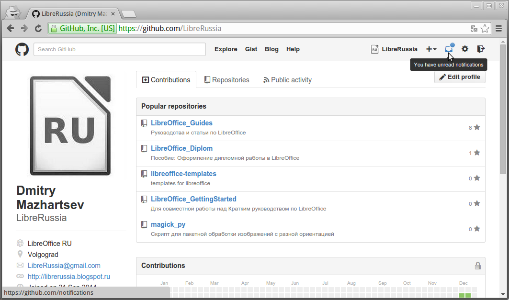

.. figure:: _static/git-img-013.png
    :scale: 40 %
    :align: center
    :alt: GitHub: Принятие Pull Requests.
    

Откроем уведомления.

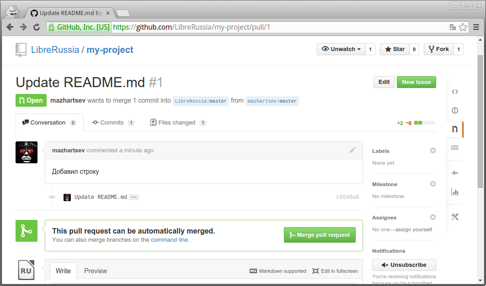
    

Чтобы выполнить слияние (англ. *Merge*) предложенных изменений нажмите кнопку ``Merge pull request``.

.. figure:: _static/git-img-015.png
    :scale: 40 %
    :align: center
    :alt: GitHub: Принятие Pull Requests.

Будет открыта страница сравнения версий. Левая колонка отображает начальную версию файла, которая сейчас находится в основном репозитории. Правая колонка отображает изменения внесенные в новый файл. Плюсами отмечены добавленные строки.

.. figure:: _static/git-img-016.png
    :scale: 40 %
    :align: center
    :alt: GitHub: Принятие Pull Requests. 

Теперь проверим файл в основном репозитории.

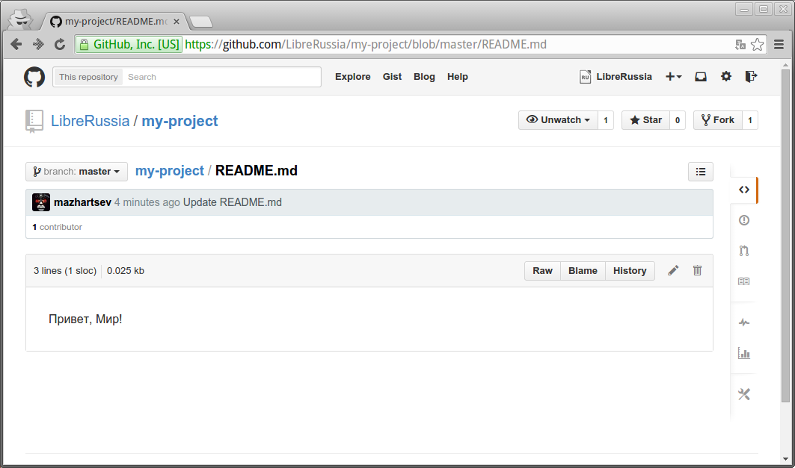

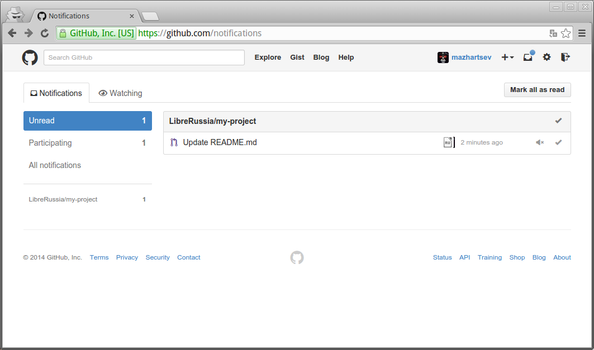

Как видно, файл успешно изменен и в нём появилась строка, добавленная другим пользователем. 

В любой момент можно отменить сделанные изменения и откатиться к предыдущим версиям файла. Все это больше относится к функциям самой системы управления версиями Git.

Подробнее о слияниях смотрите главу *Ветвление в Git* из официального руководства `Pro Git <http://git-scm.com/book/ru>`_.

Слияние копий репозиториев похоже на слияние двух веток, подробнее смотрите :ref:`branch-label`.

Статьи на тему Pull Requests:

* `UnixLab: Как сделать pull request <http://www.unix-lab.org/posts/pull-request/>`_
* `Pull request'ы на GitHub или Как мне внести изменения в чужой проект <http://habrahabr.ru/post/125999/>`_
* `Кнопка слияния на GitHub (Merge) <http://habrahabr.ru/post/118124/>`_

.. _branch-label:

Ветвление
~~~~~~~~~

Внутри одного репозитория можно создавать параллельные ветви (англ. *Branch*). Ветвление означает, что вы отклоняетесь от основной линии разработки и продолжаете работу, не вмешиваясь в основную линию. В любой момент можно выполнить слияние веток. Подробнее о ветвлении смотрите главу *Ветвление в Git* из официального руководства `Pro Git <http://git-scm.com/book/ru>`_.

Ветки напоминают функции :ref:`git-fork-label` и :ref:`pull-requests`, но при этом всё происходит в рамках одного репозитория.

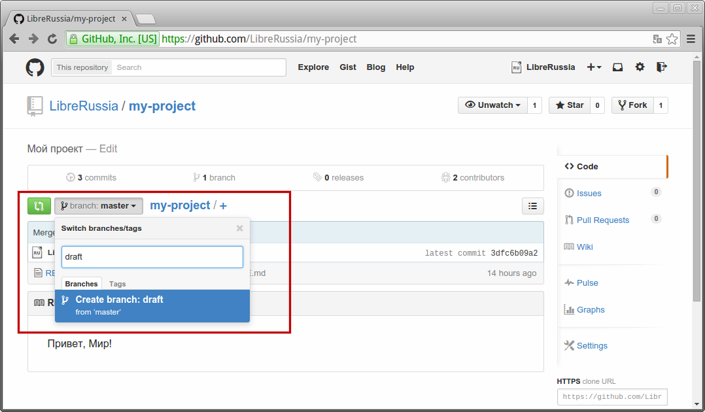

Данная функция очень полезна при создании документации, так как именно на ней основывается возможность вести  одновременно несколько версий руководства (см. :ref:`rtd-vers-label`).

Обход блокировки GitHub
~~~~~~~~~~~~~~~~~~~~~~~

Не так давно случился неприятный инцидент с блокировкой GitHub на территории России. Не буду давать какую-либо оценку данному событию, но на случай повторения ситуации приведу способы обхода блокировки.

Я воспользовался утилитой ``torsocks``, которая устанавливается вместе с `Tor <http://ru.wikipedia.org/wiki/Tor>`_. Чтобы установить Tor в Debian/Ubuntu выполните в терминале:
::

    sudo apt-get install tor

Пакет tor включает программу torsocks. Если к команде запуска программы (например, git) приписать torsocks, то её сетевая активность (включая разрешение доменов) пойдёт через Tor. Сетевая активность, которую нельзя пропустить через Tor, будет отсекаться (например, UDP). Данный способ не работает в Windows. 
::

    torsocks git push
    torsocks git pull

Другие способы обхода смотрите в статьях:

* `Краткая инструкция: GitHub через Tor <http://habrahabr.ru/post/244869/>`_
* `Обход блокировки github.com в Windows с помощью DNSCrypt <http://habrahabr.ru/post/245255/>`_
* `Краткая инструкция: GitHub через I2P  <http://habrahabr.ru/post/244861/>`_

GitHub и совместная работа над документацией
~~~~~~~~~~~~~~~~~~~~~~~~~~~~~~~~~~~~~~~~~~~~

GitHub позволяет обезопасить процесс создания документации. С одной стороны, это дополнительная резервная копия, которая не будет утеряна. С другой, возможность в случае необходимости откатиться к предыдущим изменениям. Система веток позволяет одновременно работать над несколькими версиями руководства. С помощью функции Pull Requests  все желающие могут подключиться к совместной работе и предлагать свои изменения. А редактор без лишних хлопот может безопасно принимать и контролировать все изменения в документации.

__________

Работа с Read The Docs
----------------------

Read the Docs (https://readthedocs.org) служит для хранения и публикации документации, позволяет легко в ней ориентироваться и делает её доступной для полноценного поиска. Можно импортировать документацию из проекта, используя любую известную систему контроля версий: Mercurial, Git, Subversion и Bazaar. 

Read The Docs поддерживает webhooks , так что документация может быть обновлена сразу после добавления в репозиторий нового кода. Также есть поддержка версий, поэтому можно собирать отдельные варианты (в том числе отдельные локализации) документации для тэгов и веток, которые есть в репозитории. 

* `Сайт  Read the Docs <https://readthedocs.org>`_
* `Документация Read the Docs <http://read-the-docs.readthedocs.org/en/latest/index.html>`_

.. figure:: _static/lr-img-001.png
    :scale: 40 %
    :align: center
    :alt: Read the Docs    

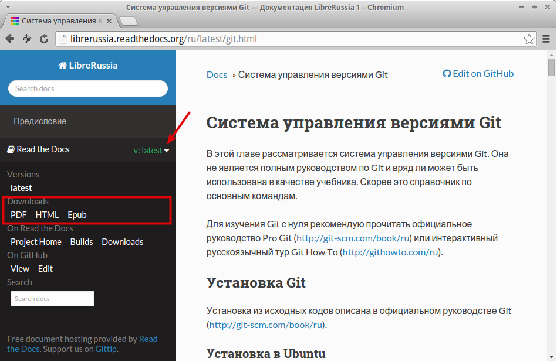

.. figure:: _static/lr-img-005.png
    :scale: 40 %
    :align: center
    :alt: Read the Docs  

Регистрация
~~~~~~~~~~~

Read the Docs полностью бесплатен, регистрация на нём не занимает много времени.

.. figure:: _static/rtd-img-001.png
    :scale: 40 %
    :align: center
    :alt: Read the Docs: Регистрация.
    

Привязка к GitHub
~~~~~~~~~~~~~~~~~~

После регистрации можно привязать свой аккаунт на GitHub или Bitbucket.

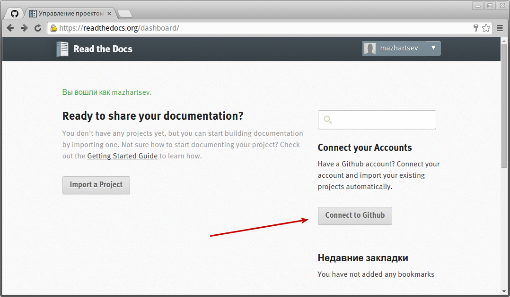

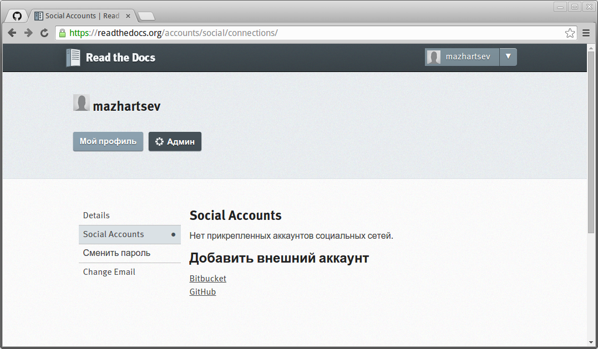

.. figure:: _static/rtd-img-004.png
    :scale: 40 %
    :align: center
    :alt: Read the Docs: Привязка к GitHub.

Создание проекта
~~~~~~~~~~~~~~~~

Прежде чем выгрузить свой проект на Read the Docs, его необходимо создать и загрузить на GitHub. Структура репозитория должна содержать папку ``docs``, в которой и будет находиться проект Sphinx (т.е. команду ``sphinx-quickstart`` нужно запускать в папке ``docs``).
::
    
    $ cd /path/to/project
    $ mkdir docs 

::
    
    $ cd docs
    $ sphinx-quickstart  
    $ make html
 
После создания Sphinx-проекта и генерации документации, загружаем репозиторий на GitHub.
  
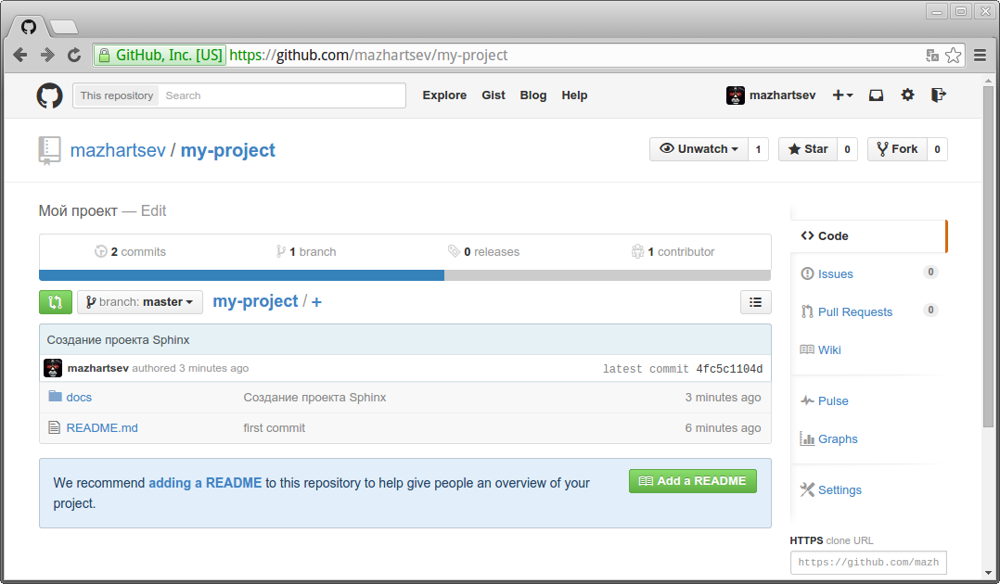

Импорт проекта
~~~~~~~~~~~~~~

После создания проекта и выгрузки его на GitHub в панели управления Read the Docs нажимаем ``Import a project``.

.. figure:: _static/rtd-img-006.png
    :scale: 40 %
    :align: center
    :alt: Read the Docs: Импорт проекта.
    
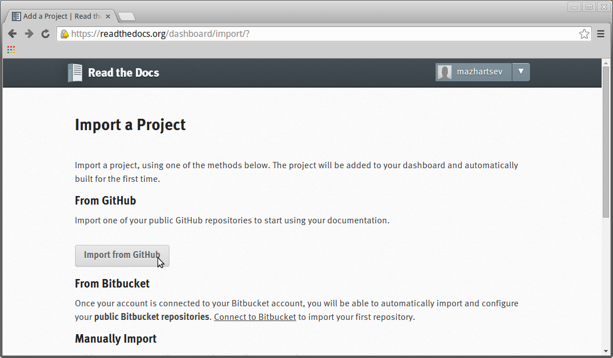
    
Синхронизируемся с GitHub и выбираем репозиторий, документация из которого будет опубликована на Read the Docs. Нажимаем кнопку ``Create``.
    
.. figure:: _static/rtd-img-008.png
    :scale: 40 %
    :align: center
    :alt: Read the Docs: Импорт проекта.
    
.. figure:: _static/rtd-img-009.png
    :scale: 40 %
    :align: center
    :alt: Read the Docs: Импорт проекта.  
    
Далее будет предложено выбрать *Имя проекта* (это будет часть URL-адреса документации *Имя-проекта.readthedocs.org*), *Тип репозитория* и также можно установить галочку *Edit advanced project options* для включения расширенных настроек.
    
.. figure:: _static/rtd-img-010.png
    :scale: 40 %
    :align: center
    :alt: Read the Docs: Импорт проекта.
    
При включении расширенных настроек на следующей странице будет предложено дать расширенное описание проекта и выбрать локализацию. Выбор локализации позволяет создавать мультиязычную документацию.

.. figure:: _static/rtd-img-011.png
    :scale: 40 %
    :align: center
    :alt: Read the Docs: Импорт проекта. 

Дальше будет предложено выбрать ещё ряд настроек таких, как версия интерпритатора (я предпочитаю собирать 3-й версией, меньше проблем с кириллицей), ветку репозитория, на основе которой будет сгенерирована версия руководства, а также стандартную версию руководства, на которую будет происходить перенаправление по умолчанию.

.. figure:: _static/rtd-img-012.png
    :scale: 40 %
    :align: center
    :alt: Read the Docs: Импорт проекта.  

После выбора всех настроек будет произведена первая сборка руководства.

.. figure:: _static/rtd-img-013.png
    :scale: 40 %
    :align: center
    :alt: Read the Docs: Импорт проекта.  

Так выглядит стандартная тема оформления Read the Docs, при желании можно использовать любую другую (см. :ref:`html-theme-label`):

.. figure:: _static/rtd-img-014.png
    :scale: 40 %
    :align: center
    :alt: Read the Docs: Импорт проекта.  

.. _auto-pub-label:

Автоматическая публикация
~~~~~~~~~~~~~~~~~~~~~~~~~

Для включения автоматической публикации документации на Read The Docs при обновлении репозитория GitHub, перейдите в репозиторий проекта на GitHub в раздел ``Settings``.

.. figure:: _static/rtd-img-015.png
    :scale: 40 %
    :align: center
    :alt: Read the Docs: Автоматическая сборка.  

Выберите пункт ``Webhooks & Services`` и добавьте сервис Read the Docs.

.. figure:: _static/rtd-img-016.png
    :scale: 40 %
    :align: center
    :alt: Read the Docs: Автоматическая сборка.      

Не путайте автоматическую публикацию с автоматической сборкой (генерацией) самой документации Sphinx, об этом подробнее смотрите раздел :ref:`sphinx-autobuild-label`.

Настройка
~~~~~~~~~

В панели управления проектом на Read the Docs в разделе ``Админ`` можно изменить настройки проекта, добавить новые версии документации, назначить кураторов и т.д.

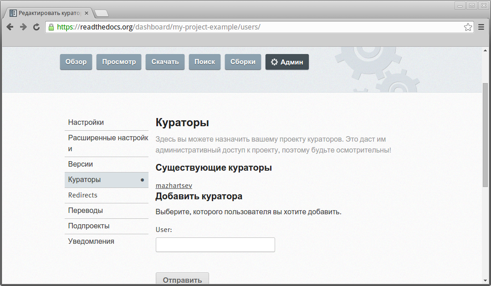

.. _rtd-vers-label:

Несколько версий документации
~~~~~~~~~~~~~~~~~~~~~~~~~~~~~

Версии документации создаются на основе веток Git-репозитория, подробнее смотрите :ref:`branch-label`.

.. figure:: _static/rtd-img-018.png
    :scale: 40 %
    :align: center
    :alt: Read the Docs: Версии.    
    
Ошибки сборки
~~~~~~~~~~~~~

В некоторых случаях могут возникать ошибки при сборке документации. Причины ошибок могут быть различны. Стандартный вывод интерпритатора содержит подробную информацию обо всех ошибках.

.. figure:: _static/rtd-img-019.png
    :scale: 40 %
    :align: center
    :alt: Read the Docs: Ошибки сборки.
    
Наиболее часто возникаю ошибки при сборке PDF. При сборке используется генерация в LaTeX. Стандартные настройки шаблона LaTeX, используемого Read the Docs, не поддерживают кириллицу. Подробнее смотрите раздел :ref:`pdf-errors-label`.
