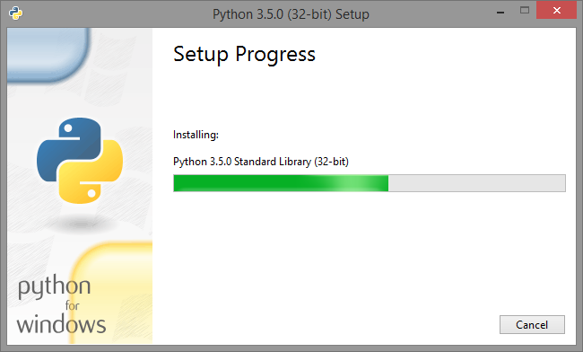

.. _win-sphinx:

Приложение I -- Установка и настройка Python Sphinx в ОС Windows
=====================================================================

Установка
------------------------------------------------

В данном разделе описана установка и настройка Python Sphinx в операционной системе Windows.

1. Скачайте установочный файл интерпритатора языка программирования Python версии ``3.5`` -- https://www.python.org.

.. figure:: _static/py-install-001.png
       :width: 400 px
       :align: center
       :alt:
	   
2. Запустите файл установки. На первом шаге поставьте галочку напротив **Add Python 3.5 to PATH** и нажмите **Install Now**.

.. figure:: _static/py-install-002.png
       :width: 400 px
       :align: center
       :alt:

3. Дождитесь завершения установки интерпритатора.

	   
4. После установки интерпритатора необходимо установить модуль Python Sphinx, для этого откройте командную строку *Пуск > cmd* и выполните команду ``pip install sphinx``.

.. figure:: _static/pip-sphinx.png
       :width: 400 px
       :align: center
       :alt:
	   
На этом установка Python Sphinx закончена, можно переходить к сборке документации. Сборка осуществляется командой:

::

	sphinx-build -b html папка\с\исходными_файлами папка\для\сконвертированных_файлов
	
Например:

::

	sphinx-build -b html source build\html
	
	
Сборка документации
------------------------------------------------

Перед началом сборки создайте папку ``docs``. Для примера создадим на рабочем столе папку ``Руководство``, а в ней папку ``docs``. Затем откройте командную строку *Пуск > cmd* и перейдите в папку с руководством, выполнив команду:

::

	cd Desktop\Руководство\docs
	

.. note:: Подробнее о работе с командной строкой Windows смотрите `Руководство по командной строке Windows <http://cmd.readthedocs.org/>`_.

Выполните команду ``sphinx-quickstart``. Программа задаст ряд вопросов. Все настройки можно будет позже изменить в файле ``conf.py``.

::

	> Корневой каталог документации. По умолчанию текущий каталог.
	> Root path for the documentation [.]: Enter
	
	> Сделать ли раздельные папки исходников и готовых страниц - Да
	> Separate source and build directories (y/n) [n]: y
	
	> Префикс для директорий с шаблонами и статическими файлами.
	> Name prefix for templates and static dir [_]:

	> Название проекта. Для начала лучше вводить на латинице.
	> Project name:

	> Имя автора/авторов. Для начала лучше вводить на латинице.
	> Author name(s):

	> Версия проекта
	> Project version:

	> Номер релиза проекта
	> Project release [1]:

	> Расширение исходного файла. По умолчанию .rst.
	> Source file suffix [.rst]:

	> Имя мастер-документа. По умолчанию index.rst.
	> Name of your master document (without suffix) [index]:

	> Генерировать ePub версию документации?
	> Do you want to use the epub builder (y/n) [n]:

	> Автоматически вставлять docstrings из модулей
	> autodoc: automatically insert docstrings from modules (y/n) [n]:

	>
	> doctest: automatically test code snippets in doctest blocks (y/n) [n]:

	>
	> intersphinx: link between Sphinx documentation of different projects (y/n) [n]:

	>
	> todo: write "todo" entries that can be shown or hidden on build (y/n) [n]:

	>
	> coverage: checks for documentation coverage (y/n) [n]:

	> Использовать модуль pngmath для вставки формул в формате png
	> pngmath: include math, rendered as PNG images (y/n) [n]:

	> Использовать модуль mathjax для вставки формул в формате MathJax
	> mathjax: include math, rendered in the browser by MathJax (y/n) [n]: y

	>
	> ifconfig: conditional inclusion of content based on config values (y/n) [n]:

	> Влючить ссылки на исходный код в документации
	> viewcode: include links to the source code of documented Python objects (y/n) [n]:

	> Создать Makefile - да
	> Create Makefile? (y/n) [y]:

	> Сделать ли файл .bat, - да
	> Create Windows command file? (Y/n) [y]: y
	

После выполнения стартового скрипта в папке ``docs`` появится следующая структура:

:: 

	docs
	└── build
	|	└── html
	|		├── ...
	|		└── index.html
	└── source
	|	├── _templates
	|	├── _static
	|	├── conf.py
	|	└── index.rst
	└── Makefile
	
``Makefile`` — содержит инструкции для генерации результирующего документа командой make.

``build`` — директория, в которую будут помещены файлы в определенном формате после того, как будет запущен процесс их генерации.

``source`` — директория, в которой располагаются исходные файлы.

``index.rst`` — это корень проекта. Он соединяет документацию воедино, если она разделена на несколько файлов.

``_static`` — в эту директорию помещаются все файлы, не являющиеся исходным кодом (например, изображения). Позже создаются связи этих файлов с директорией build.

``conf.py`` — содержит конфигурационные параметры Sphinx, включая те, которые были выбраны при запуске sphinx-quickstart в окне терминала.

Чтобы выполнить сборку документации, перейдите в папку ``docs`` и выполните команду:

::

	sphinx-build -b html source build\html

Будет выполнена сборка документации, в терминале появится информация о ходе сборки:

::

	PS C:\Users\mazhartsev\Desktop\Руководство\docs> sphinx-build -b html source build\html
	Running Sphinx v1.3.1
	making output directory...
	loading translations [ru]... done
	loading pickled environment... not yet created
	building [mo]: targets for 0 po files that are out of date
	building [html]: targets for 1 source files that are out of date
	updating environment: 1 added, 0 changed, 0 removed
	reading sources... [100%] index
	looking for now-outdated files... none found
	pickling environment... done
	checking consistency... done
	preparing documents... done
	writing output... [100%] index
	generating indices... genindex
	writing additional pages... search
	copying static files... done
	copying extra files... done
	dumping search index in Russian (code: ru) ... done
	dumping object inventory... done
	build succeeded.
	
Собранные html-файлы появятся в папаке ``build\html``.

.. tip:: Для удобства можно создать bat-файл, содержащий строку ``sphinx-build -b html source build\html``. Подробнее смотрите `Руководство по командной строке Windows <http://cmd.readthedocs.org/>`_.

Далее смотрите пункт `Файл index <http://sphinx-ru.readthedocs.org/ru/latest/sphinx.html#index>`_ в разделе :ref:`sphinx-chapter`.
